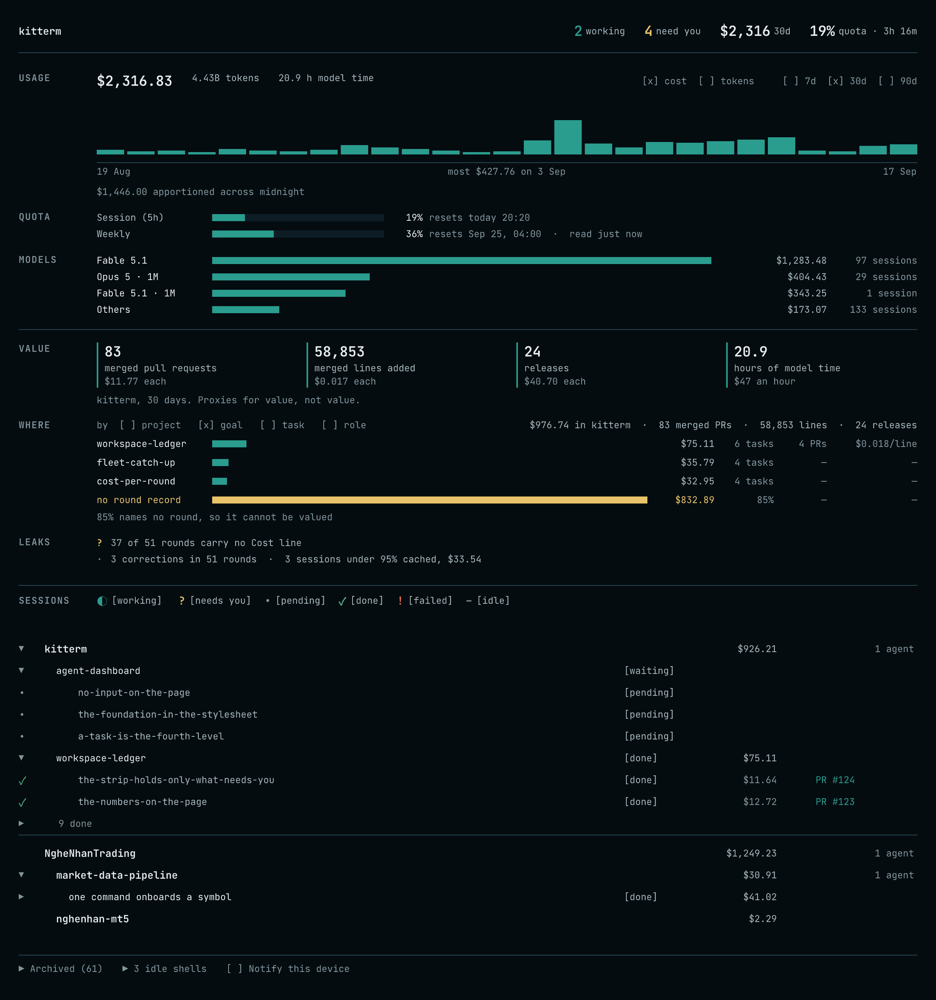

<div align="center">

# kitterm

**A terminal daemon with a ledger.**

[](https://github.com/tienan92it/kitterm/releases/latest)
[](https://github.com/tienan92it/kitterm)
[](LICENSE)

</div>
<!-- markdownlint-disable-next-line MD013 -->
<p align="center"></p>

---

kitterm is a terminal daemon with a ledger: your Mac's shell in any browser
tab, alive after the tab closes. A dashboard says what every agent in it is
doing, what it cost, and what it shipped.

## Install

```sh
curl -fsSL https://kitterm.dev/install.sh | sh
kitterm start
# → http://kitterm.localhost:3418/
```

`kitterm upgrade` installs the latest release.
`kitterm upgrade --live` takes over in place — same pid, same shells,
no dropped panes.

See [Linux](#linux) below for containers and cloud boxes.

## Terminal

A tab is a real shell with a TTY: job control, `Ctrl+C`, and TUIs work locally.

- Close the tab; reattach from any device replays the exact missed bytes.
- `⌘D` / `⌘⇧D` split a pane; `⌘⌥T` opens a new tab, same directory.
- Session profiles in `~/.kitterm/profiles.json` open a named remote shell.

### Linux

```sh
V=v0.31.0; ARCH=amd64        # or arm64
curl -fsSL -o kitterm.tar.gz \
  https://github.com/tienan92it/kitterm/releases/download/$V/kitterm-$V-linux-$ARCH.tar.gz
sudo tar -xzf kitterm.tar.gz -C /usr/local

kitterm integrate bash >> ~/.bashrc   # shell integration is not optional here
kitterm start --agent-control
```

A bare container's shell emits no OSC 133 marks, so without the integration
snippet `⌘↑`/`⌘↓` do nothing and `/api/sessions/<id>/commands` stays empty.
There is no launchd on Linux, so `kitterm start` detaches the daemon from
your shell rather than rooting it in a login session; use your init system,
or `restart: unless-stopped` in a container. Reaching it from outside a
Tailscale or reverse-proxy setup needs `--trusted-host <name>` and a token.

For a container with this already wired up, see
[kitbox](https://github.com/tienan92it/kitbox).

## Dashboard

`/sessions` is a dashboard, not a control panel: you act through a pane.

- **USAGE** charts cost or tokens per day over 7, 30, or 90 days.
- **QUOTA** draws one bar per Claude Code rate-limit window, with its age.
- **VALUE** counts merged PRs, lines, releases, and model hours, per dollar.
- **WHERE** breaks the range's spend down by project, goal, task, or role.
- **MODELS** lists the top three models by cost, others in one row.
- **LEAKS** names unattributed spend: no-cost rounds, sessions under 95% cached.
- The tree lists workspaces, projects, goals, tasks, and sessions, with cost.

Every figure follows the USAGE range. A running session shows `~$` until billed.

## The foreman and crew

`docs/goals/` is the control plane for agent work; status lives in `STATE.md`.

- A goal folder holds `goal.md`, `plan.md`, `STATE.md`, `corpus/`, `rounds/`.
- One foreman per daemon reads every `STATE.md` and spawns a crew session.
- Each round writes one record under `rounds/`, naming its cost and PR.
- `kitterm goal new <path> <slug>` writes a goal folder from the template.
- `kitterm project init --refresh <path>` rewrites an unedited `LOOP.md` from the template.

## The MCP bridge

`kitterm mcp` is a stdio MCP server that hands an agent the foreman toolset.

- Session: `list_sessions`, `get_session`, `spawn_session`, `rename_session`.
- Input and output: `send_input`, `read_output`, `read_screen`.
- Commands: `list_commands`, `wait_for_command`, `wait_for_events`.
- Bookkeeping: `post_note`, `list_approvals`, `kill_session`,
  `archive_session`, `list_archives`, `list_projects`.

Register with `claude mcp add kitterm -- kitterm mcp`, or add it to `.mcp.json`:

```json
{
  "mcpServers": {
    "kitterm": {
      "command": "kitterm",
      "args": ["mcp"]
    }
  }
}
```

The tools that drive shells need `--agent-control` on the daemon.

## Statusline

`kitterm statusline install` wraps the Claude Code statusline command.

- It posts the quota reading to the daemon on every render.
- The reading is the `rate_limits` object Claude Code hands the script.
- `/sessions` draws the QUOTA panel from it.

## Security

kitterm binds `127.0.0.1` by default; `--lan` widens that, and needs a token.

- A **watch** token can observe sessions and read the API.
- A **full** token can type, take control, or spawn a shell.
- `--agent-control` gates the routes that spawn a session or type into one.
- Off by default: it lets any admitted client drive a shell as you.

## Building from source

For the parts, the session lifecycle, and the data flows, see
[docs/architecture.md](docs/architecture.md).

Requires Swift 6 and Node 22+ with pnpm.

```sh
swift build
(cd Web/terminal && pnpm install && pnpm build)
swift run kitterm start
```

`swift test` runs the Swift suite. On Linux, `swift build` works but `swift
test` does not — several test files use `Bundle(for:)`, which
corelibs-XCTest has no equivalent for.

## License

[MIT](LICENSE) · Inspired by [localterm](https://github.com/millionco/localterm)
